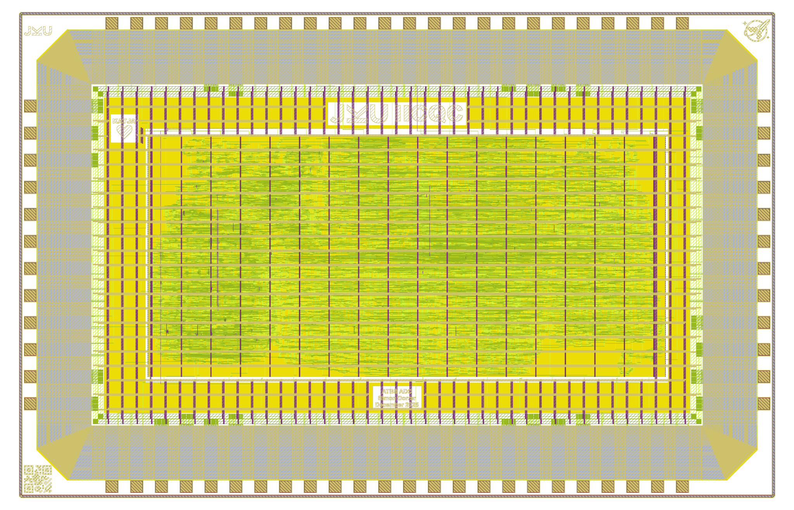

# gf180mcuD - JKU - ATBS ADC

Project `JKU2` for wafer.space MPW runs using the `gf180mcuD` PDK.

- [x] **GDS Submission:** https://platform.wafer.space/
- [x] **Precheck:** https://github.com/wafer-space/gf180mcu-precheck
- [x] **Top-Level:** pass; no violations
- [x] **ATBS ADC:** pass; no violations




## Prerequisites

We use a custom fork of the [gf180mcuD PDK variant](https://github.com/wafer-space/gf180mcu) until all changes have been upstreamed.

To clone the latest PDK version, simply run `make clone-pdk`.

In the next step, install LibreLane by following the Nix-based installation instructions: https://librelane.readthedocs.io/en/latest/installation/nix_installation/index.html

## Implement the Design

This repository contains a Nix flake that provides a shell with the [`leo/gf180mcu`](https://github.com/librelane/librelane/tree/leo/gf180mcu) branch of LibreLane.

Simply run `nix-shell` in the root of this repository.

> [!NOTE]
> Since we are working on a branch of LibreLane, OpenROAD needs to be compiled locally. This will be done automatically by Nix, and the binary will be cached locally. 

With this shell enabled, run the implementation:

```
make librelane
```

This command is also available for the macros.

## View the Design

After completion, you can view the design using the OpenROAD GUI:

```
make librelane-openroad
```

Or using KLayout:

```
make librelane-klayout
```

These commands are also available for the macros.

## Copying important Reports to the Reports Folder

To copy yosys, antenna violations, hold & setup timing and manufacturability reports of the latest run to the `reports/` folder in the root directory of the repository, run the following command:

```
make copy-reports
```

This will only work if the last run was completed without errors. This command is also available for the macros.

## Copying the Design to the Final Folder

To copy your latest run to the `final/` folder in the root directory of the repository, run the following command:

```
make copy-final
```

This will only work if the last run was completed without errors. This command is also available for the macros.

## Copying the final GDS to the GDS Folder

To copy and ZIP your latest GDS in the `final/` folder in the root directory of the repository and save it in the `gds/` folder, run the following command:

```
make copy-gds
```

This will only work if the last run was completed without errors.

## Render Layout of the Design

To render your latest GDS in the `final/` folder in the root directory of the repository and save it in the `img/` folder, run the following command:

```
make render-image
```

This will only work if the last run was completed without errors. This command is also available for the macros.

## Build Macros

To build a specific macro, look into the `Makefile` and run the corresponding command. For example, the following command builds the `tbs_core_board` macro:

```
make build-tbs_core_board
```

To build all macros, run the following command:

```
make build-all-macros
```

For each macro the following commands are executed: `make librelane`, `make copy-reports`, `make copy-final` and `make render-image`.

## Build All

To clone the PDK, build all macros, build the top-level chip, copy its reports, copy its `final/` folder, copy and ZIP its GDS, render its GDS and display it in the OpenROAD GUI, run the following command:

```
make build-all
```

This is especially useful for people who want to rebuild our chip from scratch. Just clone this repo, run `nix-shell` in the root of this repository and run `make build-all`. Enjoy. :-)

## Verification and Simulation

We use [cocotb](https://www.cocotb.org/), a Python-based testbench environment, for the verification of the chip.
The underlying simulator is Icarus Verilog (https://github.com/steveicarus/iverilog).

The testbench is located in `cocotb/chip_top_tb.py`. To run the RTL simulation, run the following command:

```
make sim
```

To run the GL (gate-level) simulation, run the following command:

```
make sim-gl
```

> [!NOTE]
> You need to have the latest implementation of your design in the `final/` folder. After implementing the design, execute 'make copy-final' to copy all necessary files.

In both cases, a waveform file will be generated under `cocotb/sim_build/chip_top.fst`.
You can view it using a waveform viewer, for example, [GTKWave](https://gtkwave.github.io/gtkwave/).

```
make sim-view
```

You can now update the testbench according to your design.
